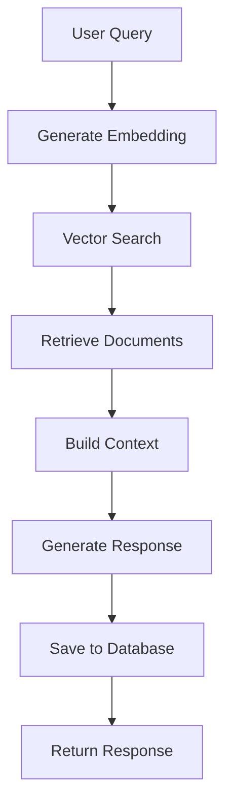

# RAG & Context Engineering Architecture

This document explains how the MCP (Model Context Protocol) setup handles RAG (Retrieval-Augmented Generation) and context engineering.

## 🏗️ RAG Architecture Overview

The system implements a **sophisticated RAG pipeline** with the following components:

```
User Query → Embedding → Vector Search → Context Retrieval → LLM Generation → Response
```

## 📊 Database Schema for RAG

### Core Tables

1. **`documents`** - Stores content with embeddings
   - `id`: UUID primary key
   - `title`: Document title
   - `content`: Full document content
   - `embedding`: Vector(1536) - OpenAI ada-002 embeddings
   - `metadata`: JSONB for additional data
   - `created_at`/`updated_at`: Timestamps

2. **`chat_sessions`** - Manages conversation sessions
   - `id`: UUID primary key
   - `user_id`: References auth.users
   - `title`: Session title
   - Timestamps

3. **`chat_messages`** - Stores conversation history
   - `id`: UUID primary key
   - `session_id`: References chat_sessions
   - `role`: 'user', 'assistant', or 'system'
   - `content`: Message content
   - `metadata`: JSONB for additional data

### Vector Search Infrastructure

```sql
-- Enable pgvector extension
create extension if not exists vector;

-- Create vector similarity index
create index on documents using ivfflat (embedding vector_cosine_ops)
with (lists = 100);

-- Search function for similarity matching
create or replace function search_documents(
  query_embedding vector(1536),
  match_threshold float default 0.5,
  match_count int default 10
)
```

## 🔄 RAG Pipeline Implementation

### 1. Document Ingestion (`/embed` endpoint)

```typescript
async function handleEmbed(request: Request, openai: OpenAI) {
  const { text } = await request.json();
  
  // Generate embedding using OpenAI ada-002
  const embedding = await openai.embeddings.create({
    model: 'text-embedding-ada-002',
    input: text,
  });
  
  return { embedding: embedding.data[0].embedding };
}
```

**Process**:
1. Receives text content
2. Generates 1536-dimensional embedding
3. Returns embedding for storage

### 2. Vector Search (`/search` endpoint)

```typescript
async function handleSearch(request: Request, supabase: any, openai: OpenAI) {
  const { query, limit = 10, threshold = 0.5 } = await request.json();
  
  // Generate query embedding
  const embedding = await openai.embeddings.create({
    model: 'text-embedding-ada-002',
    input: query,
  });
  
  // Search for similar documents
  const { data } = await supabase.rpc('search_documents', {
    query_embedding: embedding.data[0].embedding,
    match_threshold: threshold,
    match_count: limit,
  });
  
  return { results: data };
}
```

**Process**:
1. Converts query to embedding
2. Performs cosine similarity search
3. Returns ranked results with similarity scores

### 3. RAG Chat (`/chat` endpoint)

```typescript
async function handleChat(request: Request, supabase: any, openai: OpenAI) {
  const { message, sessionId, userId } = await request.json();
  
  // 1. Get conversation history
  const { data: messages } = await supabase
    .from('chat_messages')
    .select('*')
    .eq('session_id', session.id)
    .order('created_at', { ascending: true })
    .limit(10);
  
  // 2. Search for relevant documents
  const embedding = await openai.embeddings.create({
    model: 'text-embedding-ada-002',
    input: message,
  });
  
  const { data: relevantDocs } = await supabase.rpc('search_documents', {
    query_embedding: embedding.data[0].embedding,
    match_threshold: 0.7,
    match_count: 5,
  });
  
  // 3. Build context from retrieved documents
  const context = relevantDocs
    ?.map((doc: any) => `${doc.title}: ${doc.content}`)
    .join('\n\n') || '';
  
  // 4. Prepare system message with context
  const systemMessage = {
    role: 'system',
    content: `You are a helpful AI assistant. Use the following context to answer questions:

${context}

If you don't know the answer based on the context, say so. Be helpful and accurate.`,
  };
  
  // 5. Generate response with context
  const completion = await openai.chat.completions.create({
    model: 'gpt-5-nano',
    messages: [systemMessage, ...chatHistory, { role: 'user', content: message }],
    max_tokens: 1000,
    temperature: 0.7,
  });
  
  return { response: completion.choices[0].message.content };
}
```

## 🧠 Context Engineering Strategies

### 1. **Multi-Layer Context Assembly**

The system combines multiple context sources:

```typescript
// Context layers:
// 1. Retrieved documents (RAG)
// 2. Conversation history (10 recent messages)
// 3. System instructions
// 4. User query
```

### 2. **Context Prioritization**

```typescript
// High-priority context: Retrieved documents
const context = relevantDocs
  ?.map((doc: any) => `${doc.title}: ${doc.content}`)
  .join('\n\n') || '';

// Medium-priority: Conversation history
const chatMessages = [
  systemMessage,           // System context
  ...conversationHistory, // Chat history
  { role: 'user', content: message }, // Current query
];
```

### 3. **Context Quality Control**

- **Similarity Threshold**: 0.7 for high-quality matches
- **Document Limit**: 5 documents to avoid context overflow
- **History Limit**: 10 messages to maintain relevance
- **Token Management**: 1000 max tokens for responses

## 🔍 Advanced RAG Features

### 1. **Semantic Search with pgvector**

```sql
-- Cosine similarity search
select
  documents.id,
  documents.title,
  documents.content,
  1 - (documents.embedding <=> query_embedding) as similarity
from documents
where 1 - (documents.embedding <=> query_embedding) > match_threshold
order by documents.embedding <=> query_embedding
limit match_count;
```

### 2. **Context Window Management**

```typescript
// Smart context assembly
const systemMessage = {
  role: 'system',
  content: `You are a helpful AI assistant. Use the following context to answer questions:

${context}

If you don't know the answer based on the context, say so. Be helpful and accurate.`,
};
```

### 3. **Session-Based Context**

```typescript
// Maintain conversation context
const { data: messages } = await supabase
  .from('chat_messages')
  .select('*')
  .eq('session_id', session.id)
  .order('created_at', { ascending: true })
  .limit(10);
```

## 🚀 RAG Performance Optimizations

### 1. **Vector Indexing**

```sql
-- Optimized vector search index
create index on documents using ivfflat (embedding vector_cosine_ops)
with (lists = 100);
```

### 2. **Embedding Caching**

```typescript
// Reuse embeddings for similar queries
const embedding = await openai.embeddings.create({
  model: 'text-embedding-ada-002',
  input: message,
});
```

### 3. **Context Compression**

```typescript
// Limit context size
const context = relevantDocs
  ?.map((doc: any) => `${doc.title}: ${doc.content}`)
  .join('\n\n') || '';
```

## 🔐 Security & Privacy

### 1. **Row Level Security (RLS)**

```sql
-- Users can only access their own documents
create policy "Users can view their own documents" on documents
  for select using (auth.uid() = (metadata->>'user_id')::uuid);
```

### 2. **Context Isolation**

- Each user's documents are isolated
- Chat sessions are user-specific
- No cross-user data leakage

## 📈 RAG Quality Metrics

### 1. **Similarity Scoring**

```typescript
// Cosine similarity scores
1 - (documents.embedding <=> query_embedding) as similarity
```

### 2. **Context Relevance**

- **Threshold**: 0.7 for high-quality matches
- **Fallback**: System message when no context found
- **Quality Control**: "If you don't know the answer based on the context, say so"

## 🛠️ RAG Customization Options

### 1. **Adjustable Parameters**

```typescript
// Configurable RAG parameters
const { query, limit = 10, threshold = 0.5 } = await request.json();

// Chat-specific parameters
const { data: relevantDocs } = await supabase.rpc('search_documents', {
  query_embedding: embedding.data[0].embedding,
  match_threshold: 0.7,  // Higher threshold for chat
  match_count: 5,         // Fewer documents for chat
});
```

### 2. **Model Flexibility**

```typescript
// Embedding model
model: 'text-embedding-ada-002'

// Chat model
model: 'gpt-5-nano'
```

## 🎯 RAG Use Cases

### 1. **Document Q&A**
- Upload documents
- Ask questions about content
- Get answers with source citations

### 2. **Conversational AI**
- Maintain context across conversations
- Provide relevant information
- Handle follow-up questions

### 3. **Knowledge Base**
- Search through documents
- Find relevant information
- Provide accurate answers

## 🔄 RAG Workflow



## 📚 Best Practices

### 1. **Context Quality**
- Use high similarity thresholds (0.7+)
- Limit retrieved documents (5-10)
- Include source citations

### 2. **Performance**
- Cache embeddings when possible
- Use efficient vector indexes
- Monitor token usage

### 3. **User Experience**
- Provide source references
- Handle "no context" gracefully
- Maintain conversation flow

This RAG implementation provides a robust foundation for building intelligent, context-aware applications with proper document retrieval and response generation.
